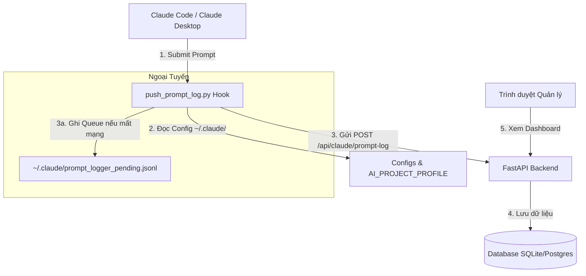

# Claude Prompt Logger System

Hệ thống nội bộ ghi nhận toàn bộ prompt gửi từ **Claude Code** hoặc **Claude Desktop** về cơ sở dữ liệu chung phục vụ mục đích quản lý và hỗ trợ học tập, huấn luyện nhân sự.

---

## 📌 Tổng Quan Hệ Thống

Hệ thống bao gồm hai thành phần chính:
1. **Backend API & Dashboard (FastAPI & Jinja2 Templates)**: Nhận dữ liệu prompt log, lưu trữ vào Database (SQLite hoặc PostgreSQL) và hiển thị trực quan thông tin thông qua Dashboard.
2. **Client Hook Script (Python)**: Hook tự động được kích hoạt khi nhân viên gửi prompt trên Claude. Nó tự động đọc cấu hình cá nhân, thông tin dự án hiện tại, trích xuất các tài liệu liên quan, và đẩy log về Backend.



---

## 📂 Cấu Trúc Thư Mục Dự Án

Khi triển khai hoàn chỉnh, cấu trúc thư mục của dự án sẽ như sau:

```text
claude-prompt-logger/
├── backend/
│   ├── app/
│   │   ├── templates/
│   │   │   ├── dashboard.html      # Giao diện chính của dashboard thống kê và danh sách
│   │   │   └── log_detail.html     # Giao diện xem chi tiết prompt và tài nguyên học tập
│   │   ├── static/
│   │   │   └── style.css           # CSS giao diện hiện đại, tối giản (Dark/Light mode hỗ trợ)
│   │   ├── __init__.py
│   │   ├── main.py                 # Điểm khởi chạy API và thiết lập định tuyến
│   │   ├── database.py             # Cấu hình SQLAlchemy và kết nối cơ sở dữ liệu
│   │   ├── models.py               # Định nghĩa ORM Model (bảng ai_prompt_log)
│   │   ├── schemas.py              # Định nghĩa Pydantic Schemas cho API
│   │   ├── config.py               # Quản lý cấu hình môi trường
│   │   └── auth.py                 # Middleware xác thực API Key đơn giản
│   ├── requirements.txt            # Danh sách thư viện Python phía backend
│   └── .env.example                # File cấu hình môi trường mẫu cho backend
│
├── client/
│   ├── push_prompt_log.py          # Script hook chính chạy khi gửi prompt
│   ├── install_hook.py             # Script tự động cài đặt hook lên máy nhân viên
│   ├── prompt_logger_config.example.json # Cấu hình local mẫu của nhân viên
│   ├── AI_PROJECT_PROFILE.example.json   # Cấu hình dự án mẫu tại thư mục làm việc
│   └── README.md                   # Hướng dẫn chi tiết cho Client
│
├── docker-compose.yml              # File deploy nhanh hệ thống bằng Docker Compose
└── README.md                       # Tài liệu hướng dẫn cài đặt và sử dụng tổng quan (File này)
```

---

## 🛢️ Cơ Sở Dữ Liệu (Database Schema)

Bảng `ai_prompt_log` chứa thông tin chi tiết về từng sự kiện prompt.

| Cột | Kiểu dữ liệu | Mô tả |
| :--- | :--- | :--- |
| `id` | `INTEGER` (PK) | Định danh tự tăng |
| `event_id` | `VARCHAR(64)` (Unique, Not Null) | UUID v4 được tạo từ Client |
| `created_at` | `DATETIME` (Not Null) | Thời gian prompt được tạo tại Client (ISO-8601 kèm timezone) |
| `server_received_at` | `DATETIME` (Not Null) | Thời gian Server nhận được request |
| `employee_email` | `VARCHAR(255)` (Not Null) | Email nhân viên gửi prompt |
| `machine_id` | `VARCHAR(255)` (Not Null) | Định danh phần cứng máy nhân viên |
| `project_name` | `VARCHAR(255)` | Tên dự án đang làm việc |
| `project_code` | `VARCHAR(100)` | Mã dự án để phân loại |
| `workspace_folder` | `TEXT` | Đường dẫn thư mục làm việc hiện tại |
| `session_id` | `VARCHAR(255)` | Phiên làm việc của Claude |
| `prompt` | `TEXT` (Not Null) | Nội dung prompt nguyên văn |
| `prompt_hash` | `VARCHAR(128)` (Not Null) | Hash SHA256 của prompt để đối chiếu nhanh |
| `related_files_json` | `TEXT` | Danh sách tên file liên quan dạng JSON Array |
| `source_app` | `VARCHAR(100)` | Ứng dụng nguồn gửi prompt |
| `hook_event` | `VARCHAR(100)` | Loại sự kiện (Ví dụ: `UserPromptSubmit`) |
| `training_resources_json`| `TEXT` | JSON chứa link tài nguyên huấn luyện (Google Drive, v.v...) |

> [!NOTE]
> Bảng cơ sở dữ liệu sẽ tự động tạo thông qua phương thức `Base.metadata.create_all()` khi ứng dụng FastAPI khởi động lần đầu tiên.

---

## 🛠️ Hướng Dẫn Cài Đặt và Chạy Backend

### Cách 1: Chạy trực tiếp trên Local (Development)

1. **Di chuyển vào thư mục backend và tạo môi trường ảo:**
   ```bash
   cd backend
   python -m venv .venv
   ```
2. **Kích hoạt môi trường ảo:**
   - **Windows (PowerShell):**
     ```powershell
     .venv\Scripts\Activate.ps1
     ```
   - **macOS / Linux:**
     ```bash
     source .venv/bin/activate
     ```
3. **Cài đặt dependencies:**
   ```bash
   pip install -r requirements.txt
   ```
4. **Cấu hình biến môi trường:**
   Copy file cấu hình mẫu và chỉnh sửa nếu cần:
   ```bash
   cp .env.example .env
   ```
   *Mặc định file `.env` đã được cấu hình chạy SQLite với API Key là `dev-secret`.*
5. **Chạy server bằng Uvicorn:**
   ```bash
   uvicorn app.main:app --reload --host 0.0.0.0 --port 8000
   ```
6. **Kiểm tra trạng thái hệ thống:**
   Truy cập [http://localhost:8000/health](http://localhost:8000/health). Phải trả về `{"status": "ok"}`.

### Cách 2: Deploy bằng Docker Compose (Khuyên Dùng cho Production/Staging)

Tại thư mục root của dự án, chạy lệnh:
```bash
docker compose up --build -d
```
Hệ thống sẽ khởi chạy backend tại cổng `8000`. Dữ liệu SQLite được persist thông qua volume `./data` ánh xạ tới thư mục `/app/data` trong container.

---

## 💻 Hướng Dẫn Triển Khai Hook Trên Máy Nhân Viên

Nhân viên sẽ chạy script `install_hook.py` để tự động tích hợp hook gửi prompt vào môi trường Claude Code của họ.

### 1. Lệnh Cài Đặt (Run Installer)

Chạy lệnh cài đặt từ thư mục dự án trên máy của nhân viên:
```bash
python client/install_hook.py \
  --employee-email nguyenvana@company.com \
  --machine-id SALE-MAC-001 \
  --api-url http://localhost:8000/api/claude/prompt-log \
  --api-key dev-secret
```
*Lưu ý: Nếu không truyền `--machine-id`, script sẽ tự động lấy hostname của thiết bị làm định danh.*

### 2. Quá trình xử lý của Installer
1. Tạo thư mục cấu hình `~/.claude/hooks/` nếu chưa tồn tại.
2. Sao chép file `push_prompt_log.py` vào thư mục hook `~/.claude/hooks/push_prompt_log.py`.
3. Tạo hoặc cập nhật file cấu hình cá nhân `~/.claude/prompt_logger_config.json` chứa:
   ```json
   {
     "employee_email": "nguyenvana@company.com",
     "machine_id": "SALE-MAC-001",
     "api_url": "http://localhost:8000/api/claude/prompt-log",
     "api_key": "dev-secret",
     "source_app": "Claude Code",
     "employee_training_folder_url": ""
   }
   ```
4. Kiểm tra và đăng ký hook vào file cấu hình Claude Code tại `~/.claude/settings.json`.
   Đối với môi trường **Windows**, cấu hình sẽ đăng ký lệnh:
   `python "%USERPROFILE%\\.claude\\hooks\\push_prompt_log.py"`
   Đối với **macOS / Linux**:
   `python3 ~/.claude/hooks/push_prompt_log.py`

---

## 📂 Quản Lý Thông Tin Dự Án (AI_PROJECT_PROFILE.json)

Để gán thông tin dự án và tài liệu học tập cụ thể cho từng thư mục làm việc, nhân sự cần tạo một file tên là `AI_PROJECT_PROFILE.json` đặt ngay tại thư mục gốc của project đang code.

### Định dạng cấu hình `AI_PROJECT_PROFILE.json` mẫu:
```json
{
  "project_name": "Claude Sales Assistant",
  "project_code": "AI-SALES-001",
  "project_training_folder_url": "https://drive.google.com/drive/folders/project-training-folder-id",
  "skill_file_url": "https://drive.google.com/file/d/skill-file-id/view",
  "instruction_file_url": "https://drive.google.com/file/d/instruction-file-id/view",
  "kb_folder_url": "https://drive.google.com/drive/folders/kb-folder-id"
}
```

Khi prompt được gửi, hook script sẽ tự động duyệt từ thư mục làm việc hiện tại (`cwd`) ngược lên các thư mục cha cho tới khi tìm thấy file `AI_PROJECT_PROFILE.json` để đọc các thông tin dự án trên. Nếu không tìm thấy, hệ thống sẽ mặc định gán thông tin dự án là `Unknown`.

---

## 🧪 Cách Thức Kiểm Tra (Testing Flows)

### 1. Test nhanh API bằng cURL
```bash
curl -X POST http://localhost:8000/api/claude/prompt-log \
  -H "Content-Type: application/json" \
  -H "X-API-Key: dev-secret" \
  -d '{
    "event_id": "test-event-001",
    "created_at": "2026-06-04T15:30:42+07:00",
    "employee_email": "nguyenvana@company.com",
    "machine_id": "SALE-MAC-001",
    "project_name": "Claude Sales Assistant",
    "project_code": "AI-SALES-001",
    "workspace_folder": "/Claude-AI-Projects/AI-SALES-001",
    "session_id": "test-session",
    "prompt": "Test prompt from curl",
    "prompt_hash": "test-hash",
    "related_files": [],
    "source_app": "Claude Cowork Desktop",
    "hook_event": "UserPromptSubmit",
    "training_resources": {
      "employee_training_folder_url": "https://drive.google.com/drive/folders/employee-folder",
      "project_training_folder_url": "https://drive.google.com/drive/folders/project-folder",
      "skill_file_url": "https://drive.google.com/file/d/skill-file/view",
      "instruction_file_url": "https://drive.google.com/file/d/instruction-file/view",
      "kb_folder_url": "https://drive.google.com/drive/folders/kb-folder"
    }
  }'
```

### 2. Chạy thử nghiệm chế độ Test của Installer
```bash
python client/install_hook.py --test
```
Lệnh này sẽ tự động đọc cấu hình tại `~/.claude/prompt_logger_config.json` và gửi một payload giả lập lên Backend để kiểm tra kết nối mạng và tính hợp lệ của API Key.

### 3. Kiểm tra khả năng hoạt động ngoại tuyến (Offline Queue)
1. Dừng ứng dụng Backend.
2. Giả lập gọi hook bằng cách gửi dữ liệu từ `stdin`:
   - **PowerShell (Windows):**
     ```powershell
     '{"session_id": "test-off-123", "transcript_path": "test.jsonl", "cwd": ".", "hook_event_name": "UserPromptSubmit", "prompt": "Prompt test khi offline"}' | python C:\Users\QUI\.claude\hooks\push_prompt_log.py
     ```
   - **Bash (macOS/Linux):**
     ```bash
     echo '{"session_id": "test-off-123", "transcript_path": "test.jsonl", "cwd": ".", "hook_event_name": "UserPromptSubmit", "prompt": "Prompt test khi offline"}' | python3 ~/.claude/hooks/push_prompt_log.py
     ```
3. Kiểm tra file `~/.claude/prompt_logger_pending.jsonl` được tạo ra chứa payload ngoại tuyến.
4. Bật lại ứng dụng Backend.
5. Thực hiện giả lập gửi một prompt mới. Hook sẽ tự động gửi kèm và giải phóng toàn bộ hàng đợi offline trước đó vào Database của Backend.

---

## 📊 Giao Diện Dashboard & Tài Nguyên Huấn Luyện

Truy cập [http://localhost:8000](http://localhost:8000) để theo dõi:
- **Thống kê tổng hợp**: Số lượng prompt đã ghi nhận, số lượng nhân viên hoạt động, số dự án đang chạy.
- **Bộ lọc mạnh mẽ**: Tìm kiếm nhanh theo khoảng thời gian, email, mã dự án, từ khóa trong prompt.
- **Xem chi tiết Prompt Log**: Xem nguyên văn câu lệnh (giữ nguyên định dạng xuống dòng), danh sách file liên quan.
- **Tài nguyên Huấn luyện (Training Resources)**: Hiển thị trực quan và cung cấp liên kết nhanh mở ở tab mới (`target="_blank"`) đối với các file/thư mục đào tạo đính kèm của nhân viên và dự án:
  - Thư mục huấn luyện nhân viên (Employee Training Folder)
  - Thư mục huấn luyện dự án (Project Training Folder)
  - File kỹ năng (Skill File)
  - Hướng dẫn dự án (Instruction File)
  - Thư mục cơ sở tri thức (KB Folder)
